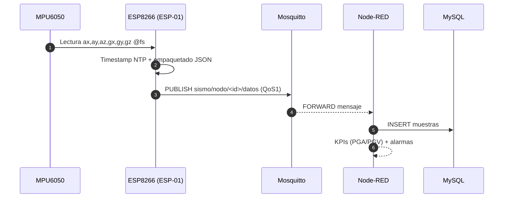

# Proyecto Tipo C · Red de nodos de adquisición de datos sismográficos

> Monitoreo de vibraciones/sismos en edificación universitaria con nodos ESP8266 + MPU6050, backend Node-RED/Mosquitto/MySQL en Ubuntu Server. 

---

## 1) Contexto y alcance

* **Dominio:** monitoreo sísmico estructural en la Facultad de Medicina (UNCuyo), con **4–10 nodos** distribuidos en puntos de interés. 
* **Tecnologías núcleo:** Node-RED (gestión/visualización), Mosquitto (MQTT), MySQL (persistencia), Ubuntu Server (SO). 
* **Nodo:** ESP8266 (ESP-01) + MPU6050 (GY-521), alimentación fija y Li-ion, PCB propia. 
* **Motivación:** alternativa **de bajo costo** con desempeño “accionable” frente a soluciones comerciales de alta precisión pero costosas.  

**Objetivo general:** validar la factibilidad y el error objetivo (≤10%) mediante prototipado, pruebas y calibración.  

---

## 2) Arquitectura (E2E)

```mermaid
flowchart LR
  subgraph Nodos [Capa Nodos (4–10)]
    A1[ESP8266/ESP-01<br/>MPU6050 (GY-521)] -->|MQTT QoS1| BRK[(Mosquitto)]
    A2[ESP8266/ESP-01<br/>MPU6050 (GY-521)] -->|MQTT QoS1| BRK
  end

  BRK --> NR[Node-RED<br/>Flows + Dashboards]
  NR  --> DB[(MySQL)]
  NR  --> A[Alertas/Notificaciones]
  style BRK fill:#eee,stroke:#333
  style DB fill:#eee,stroke:#333
```

**Notas:**

* Visualización y orquestación en **Node-RED**, broker **Mosquitto**, almacenamiento **MySQL** sobre **Ubuntu Server**. 
* Escalabilidad por cobertura de **4–10** dispositivos; despliegue in situ en el edificio objetivo. 

---

## 3) Estructura del repositorio

```
.
├─ firmware/                # Código ESP8266 (ESP-01) + MPU6050
   ├─ src/
   └─ include/
├─ design/                  # 3D models
│  ├─ Acoples/              
│  ├─ Accesorios/                 
│  └─ Impresiones 3D/                   
├─ PCB/
│  └─ Diseño de módulo      
├─ docs/
│  ├─ arquitectura.md
│  ├─ calibracion.md
│  └─ o&m.md
└─ README.md
```

---

## 4) Requisitos

* **Nodo:** Módulo ESP-07, módulo GY-521, fuente 5 V + step-down 3.3 V, batería Li-ion opcional. 
* **Servidor:** Ubuntu Server con Node-RED, Mosquitto y MySQL. 

---

## 5) Firmware (ESP8266 + MPU6050)

**Intención:** lectura de aceleraciones/giroscopio, timestamp NTP, buffer local, MQTT QoS1 con reconexión y LWT, watchdog, empaquetado JSON/CBOR.

**Supuestos de diseño:**

* Frecuencia de muestreo recomendada 100–200 Hz para vibraciones estructurales de baja a media frecuencia.
* Antialiasing digital simple con media móvil/BIQUAD; calibración in situ en etapa de instalación.

**Esqueleto de payload (JSON):**

```json
{
  "node_id": "FACMED-03",
  "ts_unix_ms": 1733345678901,
  "ax": -0.0123, "ay": 0.0045, "az": 1.0012,
  "gx": 0.12, "gy": -0.05, "gz": 0.02,
  "vbat": 3.94, "temp": 28.4, "seq": 15231
}
```

**Tópicos MQTT:**

```
sismo/nodo/<node_id>/datos       (QoS1, no retenido)
sismo/nodo/<node_id>/estado      (QoS1, retenido)      # heartbeats
sismo/nodo/<node_id>/lwt         (QoS1, retenido)      # Last Will
sismo/cmd/<node_id>              (QoS1)                # control
```

**Criterios de prueba rápida:**

1. Pérdida de WiFi: datos en buffer y reenvío al reconectar.
2. Desconexión broker: activación de **LWT** y recuperación de sesión.
3. Variación NTP: jitter de timestamp < 20 ms en red local.

---

## 6) Backend

### 6.1 Mosquitto (MQTT)

**Intención:** broker central con TLS, usuarios/ACL y LWT.

```conf
# deploy/mqtt/mosquitto.conf (resumen)
listener 8883
cafile /etc/mosquitto/certs/ca.crt
certfile /etc/mosquitto/certs/server.crt
keyfile /etc/mosquitto/certs/server.key
require_certificate false
allow_anonymous false
password_file /etc/mosquitto/passwd
acl_file /etc/mosquitto/acl
persistence true
persistence_location /var/lib/mosquitto/
```

**ACL mínimo de ejemplo:**

```
user nodo01
topic write sismo/nodo/nodo01/#
topic read  sismo/cmd/nodo01

user nodered
topic read  sismo/nodo/+/datos
topic read  sismo/nodo/+/estado
topic read  sismo/nodo/+/lwt
topic write sismo/cmd/+
```

### 6.2 Node-RED

**Intención:** ingestión MQTT, cálculo de KPIs (PGA/PGV), alarmas y dashboard.
**KPIs sugeridos:** PGA, PGV, espectros de respuesta 5% amort.
**Entrega:** flujos exportables en `backend/nodered/flows/*.json`.

### 6.3 MySQL (modelo de datos)

**Intención:** persistencia de series temporales y metadatos.

```sql
-- backend/db/schema.sql (resumen)
CREATE TABLE nodes (
  id VARCHAR(32) PRIMARY KEY,
  alias VARCHAR(64),
  location VARCHAR(128),
  installed_at DATETIME,
  active TINYINT DEFAULT 1
);

CREATE TABLE samples (
  id BIGINT AUTO_INCREMENT PRIMARY KEY,
  node_id VARCHAR(32) NOT NULL,
  ts_unix_ms BIGINT NOT NULL,
  ax FLOAT NOT NULL, ay FLOAT NOT NULL, az FLOAT NOT NULL,
  gx FLOAT, gy FLOAT, gz FLOAT,
  vbat FLOAT, temp FLOAT, seq BIGINT,
  KEY k_node_ts (node_id, ts_unix_ms),
  CONSTRAINT fk_samples_node FOREIGN KEY (node_id) REFERENCES nodes(id)
);

CREATE TABLE events (
  id BIGINT AUTO_INCREMENT PRIMARY KEY,
  started_at DATETIME NOT NULL,
  ended_at   DATETIME,
  max_pga FLOAT, max_pgv FLOAT, note VARCHAR(255)
);
```

**Criterios de prueba rápida:**

* Inserción sostenida ≥ 200 msg/s en LAN con retardo < 100 ms E2E.
* Consultas por ventana móvil de 5 min bajo 200 ms.

---

## 7) Despliegue

### 7.1 Docker Compose (opcional)

```yaml
# deploy/docker-compose.yml
version: "3.9"
services:
  mosquitto:
    image: eclipse-mosquitto:2
    ports: ["1883:1883", "8883:8883"]
    volumes:
      - ./mqtt/mosquitto.conf:/mosquitto/config/mosquitto.conf:ro
      - ./mqtt/certs:/etc/mosquitto/certs:ro
      - mosq_data:/var/lib/mosquitto
  nodered:
    image: nodered/node-red:latest
    ports: ["1880:1880"]
    environment:
      - TZ=America/Argentina/Mendoza
    volumes:
      - ./nodered/data:/data
  mysql:
    image: mysql:8
    environment:
      - MYSQL_ROOT_PASSWORD=changeme
      - MYSQL_DATABASE=sismo
    ports: ["3306:3306"]
    volumes: [ "mysql_data:/var/lib/mysql" ]
volumes: { mosq_data: {}, mysql_data: {} }
```

### 7.2 Ubuntu Server

* Instalar paquetes base, habilitar firewall, configurar TLS y usuarios para broker y DB. 

---

## 8) Seguridad y roles

* **Transporte:** TLS en MQTT y en accesos al dashboard.
* **Autenticación:** usuarios separados por rol: `nodo`, `nodered`, `ops`.
* **Principio de mínimo privilegio:** ACL por tópico.
* **DB:** credenciales por servicio, rotación y backups programados.

---

## 9) Calibración y validación

* **Metodología:** prototipado → pruebas con estímulos conocidos → calibración para error ≤10%. 
* **Resultados esperados:** sistema instalado, base de datos operativa, informe técnico. 

---

## 10) Plan de pruebas

1. **Nodo**: watchdog, reconexión, buffer offline, precisión de timestamp.
2. **Red**: caída de WiFi y broker, recuperación de sesión MQTT.
3. **Integración**: ingestión Node-RED → MySQL, latencia y throughput.
4. **Resiliencia**: microcortes de energía, persistencia del broker.
5. **Validación**: comparación contra referencia en mesa vibratoria/estímulo controlado.

---

## 11) Instalación in situ y O&M

* **Ubicación y fijación** de nodos en la estructura; coordinación con autoridades para permisos y posiciones. 
* **Mantenimiento mínimo:** recambio/recarga de batería Li-ion según desgaste. 

---

## 12) Roadmap (alto nivel)

1. Diseño y prototipado del nodo.
2. Backend en nube y pruebas de integración.
3. Fabricación 4–10 unidades, instalación, optimización. 

---

## 13) Trazabilidad (resumen)

* **Requisito**: bajo costo y despliegue escalable → **Diseño**: ESP8266 + MPU6050; **Implementación**: MQTT/Node-RED/MySQL; **Prueba**: error ≤10%; **Resultado**: sistema instalado y DB operativa.   

---

## 14) Contribución

* PRs con tests y flujos reproducibles.
* Convenciones: commits tipo Conventional Commits, revisiones de seguridad básicas.

---

## 15) Licencia

Licencia MIT.

---

## 16) Créditos

* **Organismo:** Facultad de Ingeniería – UNCuyo. **Espacio:** Mecánica Vibratoria. 
* **Beneficiarios:** Facultad de Medicina (sistema + acceso lector a DB); cátedra Mecánica Vibratoria (nodo didáctico).  

---

## 17) Referencias del proyecto

* Documento base del proyecto: “Proyecto Tipo C: Red de nodos de adquisición de datos sismográficos.” (PDF). 
* Contexto y motivación (“Key Information”). 

---

### Anexo A · Diagrama de secuencia (telemetría)



---

> **Cómo usar este README**
>
> 1. Adaptá el `docker-compose.yml` a tu servidor.
> 2. Importá los flujos Node-RED y conectá al broker y DB.
> 3. Flasheá el firmware del ESP-01 con tus credenciales WiFi/MQTT.
> 4. Corré pruebas de red, ingestión y calibración hasta cumplir el ≤10% de error. 

---


Medical References:
1. None — DOI: file-QWTmTeDuec8pwW5nHiFvFW
